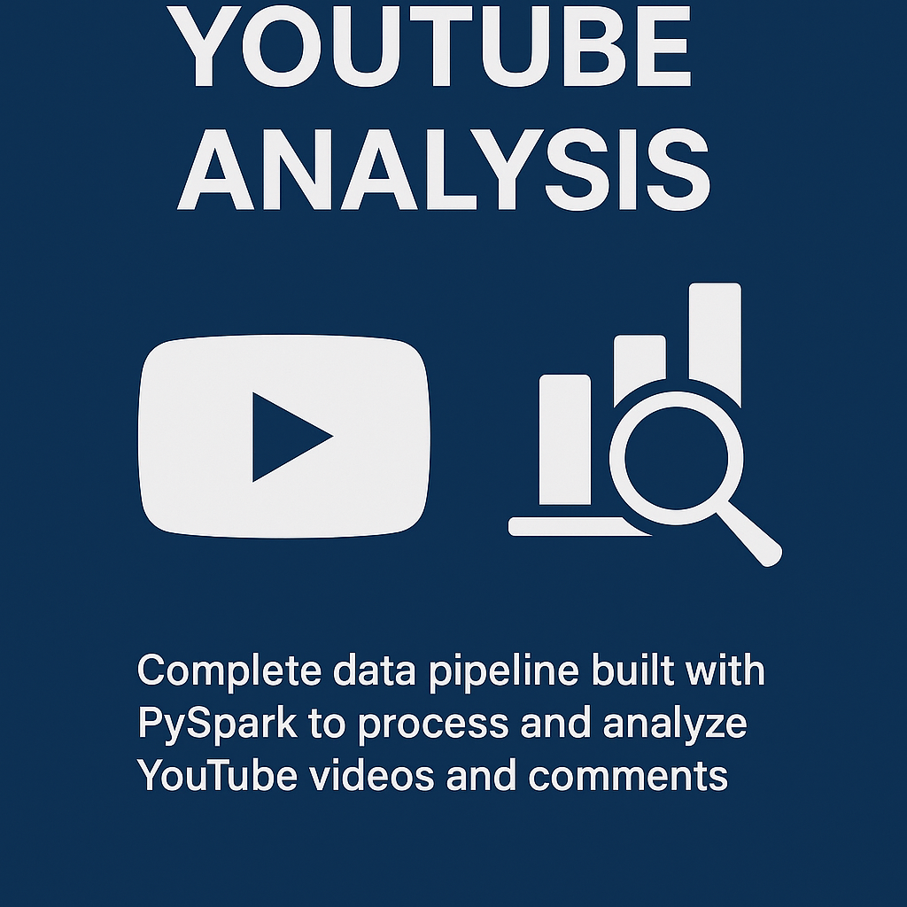

# YouTube Analysis

This project consists of a complete data pipeline built with **PySpark** to process, analyze, and model data related to YouTube videos and comments. It includes steps for reading, cleaning, transforming, feature engineering, and statistical analysis.

---

## Technologies Used

- Python 3.11+
- PySpark (Spark MLlib, DataFrame API)
- Google Drive (`gdown` for file download)
- Pandas (optional, for comparison)
- Jupyter / Google Colab (execution environment)

---

## Project Structure

youtube-pyspark-pipeline
┣ data
┃ ┣ videos.csv
┃ ┗ comentarios.csv
┣ youtube_analysis.py
┗ README.md

---

##  Features

-  Automatic file download via `gdown`
-  Data cleaning and preprocessing
-  Aggregated statistics by channel, category, and date
-  Feature engineering on text and date columns
-  Linear regression modeling to predict views
-  Dimensionality reduction using PCA
-  Data normalization with MinMaxScaler
-  Analysis of variance, averages, counts, and outliers

---

##  How to Run

1. Clone the repository:

git clone https://github.com/your-username/youtube-pyspark-pipeline.git
cd youtube-pyspark-pipeline
Install the required packages:

pip install pyspark gdown

2. Or open notebook in Jupyter

Youtube_Data_Analysis.ipynb

## License

This project is licensed under the MIT License. See the `LICENSE` file for details.

---

## Author

Bruno Brehmer Massaneiro

